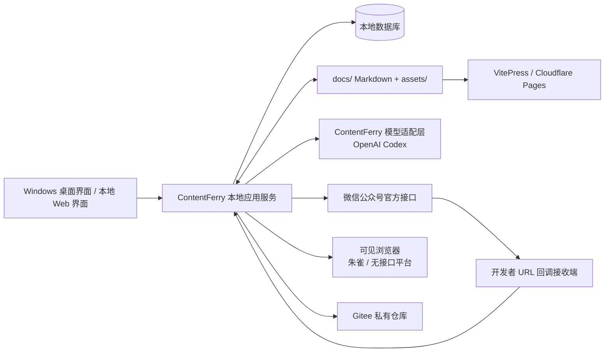
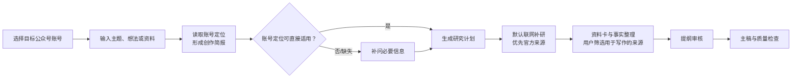
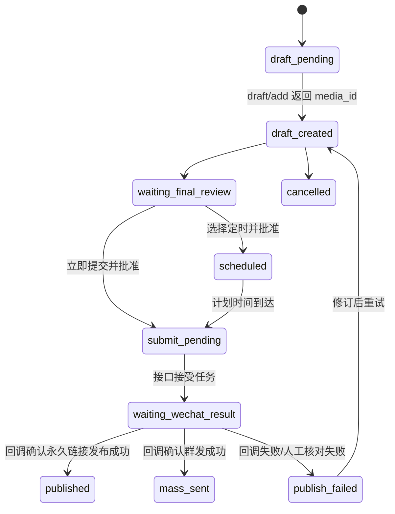

# ContentFerry 一期开发设计

> 状态：工程脚手架已建立 0.3
> 日期：2026-07-19
> 依据：[产品需求文档](01-product-requirements.md)

## 1. 目标与边界

一期交付 Windows 单机版。用户从主题、想法或资料开始，AI 在已确认的账号定位与研究范围内协助创作；系统完成公众号内容质量检查、官方接口发布、结果回写，以及 CSDN 的发布后运营辅助。

核心原则：

- 正文和素材保持普通 Markdown 文件；运行状态保存在本地数据库。
- 微信公众号发布以官方接口为主，浏览器仅作为朱雀检测、无接口平台和接口后备路径。
- 草稿、提交、回调确认是不同状态；接口接受任务不等于发布成功。
- 所有外部写操作可追溯、可恢复且避免重复提交。
- 一期为单写者，但所有领域对象、接口和凭据均带工作空间与媒体账号边界，为 SaaS 扩展保留空间。

## 2. 一期总体架构



`CALLBACK` 是公众号接口闭环的前置能力：必须可被微信访问、校验签名，并将事件可靠传送到本地应用。具体部署方式尚未确定，见第 8 节。

### 2.1 运行时约束

一期不预先锁死桌面框架或数据库 ORM，但实现必须满足以下可替换运行时契约：

- 桌面壳只负责启动、升级、托盘状态和窗口管理；业务逻辑必须运行在独立的本地应用服务中，使浏览器访问本地服务与桌面壳复用同一套领域 API。
- 本地服务默认只绑定回环地址，不向局域网暴露管理 API；桌面壳或本地浏览器通过随机本地会话令牌访问。
- 工作流执行器、定时调度器和回调处理器不能依赖某个 UI 窗口存活。需要定时发布时，安装包必须提供随系统启动或用户登录启动的后台代理；若代理未运行或电脑关机，任务进入 `missed_schedule` 等待用户决定重新计划或取消，绝不补发群发通知。
- 所有外部写操作通过持久化任务队列执行；UI 只能请求创建任务，不能直接调用公众号接口或浏览器自动化。
- 时间统一以 UTC 持久化、以工作空间时区显示；一期默认 `Asia/Shanghai`。

### 2.2 运行时目录与数据目录分层（已实现）

ContentFerry 同时存在两层由 Electron 管理的目录，二者独立、互不影响，不能混为一谈：

1. **运行时目录（`userData` 根）**：由 Electron 应用名（`contentferry`）决定，Windows 上默认位于 `C:\Users\<用户名>\AppData\Roaming\contentferry`。它包含两类内容：
   - **启动定位配置 `app-settings.json`**：记录用户选择的数据目录位置、首次启动标记与 AI 初始化状态。该文件必须独立于“数据目录”存在，因为数据目录本身正是首次启动向导要用户选择的目标，且需跨卸载/跨数据目录删除保留（见 `spec/04` §2）。
   - **Electron 框架运行时文件**：`Preferences`、会话存储、`Local Storage`、`Cache`、`GPUCache`、`blob_storage` 等，由 Electron/BrowserWindow 自动在 `userData` 维护，与主进程业务代码无关，**不受数据目录配置影响**。
2. **数据目录（`dataDir`）**：真正的业务数据根。默认值为 `userData/data`，可通过首次启动向导或 `CONTENTFERRY_DATA_DIR` 环境变量覆盖为任意位置（如其他磁盘）。其中包含 SQLite 数据库、技能副本（`skills/`）、内部素材、AI 沙箱、诊断日志等。

落在 `userData` 根目录的文件（配置 + 框架运行时）与落在 `dataDir` 的业务数据应当分开理解：迁移数据目录只移动后者，前者始终留在 `userData` 并随应用重新生成或重新写入。

## 3. 进程与模块边界

| 模块         | 职责                                                   | 不负责                     |
| ------------ | ------------------------------------------------------ | -------------------------- |
| 桌面/UI 层   | 内容编辑、审核、账号管理、任务进度、人工接管           | 保存业务状态、直接存储密钥 |
| 本地应用服务 | 领域规则、工作流、版本、审核、任务调度、审计           | 直接依赖某个前端页面状态   |
| 文件同步模块 | 扫描`docs`、原子写入、标题目录重命名、VitePress 兼容 | 工作流与平台发布状态       |
| 模型适配器   | 自行接入 Codex 等模型，提供研究、提纲、写作、修订和流式生成（联网检索由应用自有 WebSearchClient 承担，不绑定单一模型） | 决定最终发布或覆盖人工版本 |
| 微信连接器   | Token、草稿、永久链接发布、群发、回调映射、结果查询    | 文章主稿、审核规则的事实源 |
| 浏览器执行器 | 朱雀网页检测、无接口平台辅助、人工接管                 | 绕过验证码或平台安全限制   |
| 回调接收端   | 微信签名校验、事件持久化、可靠转发                     | 长期保存正文或明文凭据     |

微信公众号“原创、赞赏、合集”不依赖未验证的公开 API。文章设置在创建草稿时复制到 `wechat_publish_jobs` 的设置快照（`declare_original`、`enable_reward`、`collection_name`）；发布中心启动浏览器辅助时只读取该快照，避免后来编辑文章设置改变一份已创建的草稿。可见浏览器先唯一定位草稿标题，再对可识别的开关执行幂等设置；无法确定控件状态、存在同名合集或页面结构变化时不猜测、不点击，保留页面、显示接管提示并由用户完成最后预览与发布。

### 3.1 OpenAI Codex 接入边界

ContentFerry 不安装、不启动、不调用 Hermes Agent。Hermes Agent 只用于阅读和借鉴以下实现：provider 与业务流程解耦、授权状态解析、Responses 流式事件消费、取消与超时、用量归一化及可恢复错误分类。

一期在本地应用服务中实现自有模型适配层：

1. `ModelProvider` 定义能力探测、授权状态、结构化生成、流式生成、取消和用量查询。
2. `OpenAICodexProvider` 使用 ChatGPT/Codex 订阅授权，优先基于 OpenAI 官方 Codex SDK 或 app-server 接口实现。
3. `AiTaskService` 将创作简报、研究计划、提纲、正文和局部改写转换为版本化任务，不让页面或领域仓储直接依赖 Codex 协议。
4. `ai_run` 与 `ai_run_event` 保存任务状态、输入版本引用、模型、输出版本、用量、错误和恢复位置；访问令牌只进入系统加密凭据存储。
5. 适配器不得依赖 Hermes 的进程、配置目录、认证文件、插件、技能或会话数据库，也不得把未公开承诺稳定的 ChatGPT 内部接口固化为不可替换的产品契约。

OpenAI API Key provider 与其他模型后续复用同一接口；切换 provider 不改变文章、资料、审核和发布领域模型。

### 3.2 联网补研与模型解耦

早期实现把“联网补研”硬绑定到 OpenAI Codex：实时网页检索依赖 Codex SDK 内置的 `webSearchMode: "live"`，其它 provider（`chat/completions`、Copilot）没有联网能力，`configured-model-provider.ts` 因此在调用前以护栏 fail-fast，要求补研必须用 Codex。这带来两个后果：补研无法跨模型通用，且审计看不到具体来源 URL（Codex 的检索发生在 SDK 进程内，应用只收到查询词）。

解耦方案：把“搜索 + 抓取网页”这一步改为由应用自主承担，再把检索结果喂给任意模型做综合。

- 应用自有检索层 `WebSearchClient`（`src/main/ai/web-search.ts`）：provider 注册表 + 能力标志（`supportsSearch` / `supportsExtract`）+ 回退链。Tavily（配置 `TAVILY_API_KEY` 时启用）优先，Bing RSS 与 DuckDuckGo 构成零密钥双重兜底；任一公开搜索页出现反爬虫验证或临时失败时，自动尝试下一个搜索源。检索与任何具体模型解耦。
- 当 API/RSS 与 HTTP 检索均失败时，桌面版可追加“可见浏览器检索”后备：使用 Electron 的持久会话分区打开目标搜索页、读取已呈现的结果；如页面要求登录或人机验证，保留窗口与会话并返回 `BrowserVerificationRequiredError`，由用户完成操作后主动重试。可见浏览器检索会注入与真实 Chrome 一致的指纹（参考 gstack `browse/src/stealth.ts` 的一致性优先反检测，落地于 `src/main/research-stealth-preload.ts`：遮 `navigator.webdriver`、还原 `window.chrome.*`、对齐 `Notification.permission` 与 `hardwareConcurrency`/`deviceMemory`、清理 `__webdriver*`/`cdc_*` 等自动化全局），以降低反爬系统的误判封锁；刻意不伪造 WebGL/插件等扩展项。该伪装仅在被站点实际挑战（captcha/人机验证）时才移交人工，不得自动点击 CAPTCHA，也不得绕过任何站点访问控制。
- 多轮主动探索在两个方案中都保留，由 `ConfiguredModelProvider.webResearch` 统一编排：
  - 方案 B（通用，任何不支持工具调用的模型都可用）：由应用驱动循环；每轮让模型按 JSON 协议 `{action:"search"|"done", query?}` 规划下一步检索方向，应用执行 `WebSearchClient.search` 并累积来源，直到模型返回 `done` 或达到最大轮数（默认 5）。
  - 方案 A（模型支持工具调用时优先：openai / openrouter / nous / nvidia_build）：把 `web_search` 作为函数工具暴露给模型，由主进程执行工具循环（模型发工具调用 → 应用检索 → 回填结果 → 重复直至模型停止）。若方案 A 失败或无工具调用，自动降级到方案 B。
- 最终综合（synthesis）使用 `json_schema` 结构化输出，不再使用工具或 Codex 检索；模型只基于已检索来源整理资料卡，不得自行联网、不得编造链接。综合可在任意已配置文本模型上运行。
- 审计：每次补研在审计日志中记录 `retrieval` 摘要（轮数、来源条数、实际使用的检索 provider），来源 URL 现在对审计可见、可追溯。
- 装配：`create-server.ts` 通过 `createWebSearchClient({ getTavilyApiKey })` 注入检索层；Tavily API Key 可在“技能与模型 → 联网检索服务”中配置，使用 `AppCredentialRepository` 加密保存，并在每次检索时动态读取，因此保存后无需重启本地服务。开发环境中的 `TAVILY_API_KEY` 仅作兼容兜底；本机保存的 Key 优先。`OpenAICodexProvider` 在研究流程中仅作为综合模型使用（`webSearchMode: "disabled"`），不再承担检索。
- **补研技能必须显式指定模型，不再默认 Codex**：`web-research` 技能的 `defaultProvider` 已改为 `null`，`ConfiguredModelProvider.webResearch` 在技能未指派 provider 时直接抛出明确提示（“请在技能与模型中为该技能选择一个模型连接”），不再静默回退到 `openai_codex`。UI 上“研究”类技能（分类 `研究`）已纳入“文本类技能”可切换模型分组（此前因分类不在任何分组中而不显示，导致用户无法改派、一直卡在默认 Codex）。补研实际使用的模型完全由用户在“技能与模型”里为该技能指派，与其直觉一致。

本方案借鉴了 Hermes Agent 的“provider 注册表 + 能力标志 + 统一响应信封 + 回退链”思路，但检索工具为应用自有、网络访问不与任何模型绑定。

## 4. 核心数据模型

所有记录都包含 `workspace_id`、创建/更新时间和审计字段。单机模式固定为一个工作空间，但服务接口仍显式传递该字段。

| 对象                  | 关键字段                                          | 说明                                     |
| --------------------- | ------------------------------------------------- | ---------------------------------------- |
| `media_account`     | 平台、账号标识、人设、能力等级、凭据引用          | 公众号或 CSDN 的具体账号                 |
| `account_profile`   | 定位、读者、禁区、语气、栏目、来源版本            | 历史文章提炼后由用户确认，或由用户录入   |
| `content_project`   | 主题、创作简报、目标账号、内容状态                | 围绕一个主题的工作单元                   |
| `source_card`       | 来源类型、URL/文件、摘要、获取时间、可信/待核状态 | 用户资料、联网补研资料和 AI 推断明确区分 |
| `article_version`   | 主稿/渠道稿、父版本、哈希、Markdown 路径          | 不可变版本快照                           |
| `review_task`       | 提交者类型、提交版本、审核门、结论、意见          | 提交者为 AI、人工或系统                  |
| `workflow_instance` | 模板版本、当前状态、检查点、上下文                | 可暂停、重启恢复                         |
| `wechat_draft`      | 账号、`media_id`、渠道稿版本、草稿状态          | 公众号 API 草稿映射                      |
| `wechat_asset`      | 本地素材哈希、用途、远端素材 ID、账号、过期状态   | 封面、正文图片等上传素材的账号隔离映射   |
| `publish_job`       | 发布模式、计划时间、幂等键、提交状态、尝试次数    | 永久链接发布或群发                       |
| `publish_receipt`   | 回调事件、远端 ID/URL、最终状态、失败原因         | 最终事实记录                             |
| `callback_event`    | 接收时间、签名状态、事件指纹、原始加密载荷摘要    | 回调的不可变入站记录                     |
| `outbox_job`        | 任务类型、业务键、可重试时间、状态、锁定者        | 数据库提交后异步执行外部操作             |
| `file_sync_state`   | 文件路径、内容哈希、最后同步版本、冲突状态        | 外部 Markdown 改动检测与冲突处理         |
| `credential_ref`    | 密钥别名、加密存储位置、轮换状态                  | 不在 Markdown、日志或 Git 中保存明文     |

### 4.1 一致性、唯一性与删除规则

- `article_version` 不可修改；人工改写、AI 重写和审核页即时修订均创建新版本，并以父版本关联。
- `wechat_draft` 的唯一业务键为“账号 + `media_id`”；`publish_job` 的唯一幂等键为“账号 + 草稿 + 发布模式 + 渠道稿版本”。同一草稿不能在同一模式下被重复创建提交任务。
- `callback_event` 先落库再处理，以微信事件的稳定字段或加密载荷哈希去重；重复事件只能更新处理时间，不能重复生成回执。
- `outbox_job` 与业务状态在同一数据库事务中提交。服务崩溃后，未完成任务由租约超时回收；同一账号的 Token 刷新和草稿提交使用账号级锁。
- 媒体账号、文章和版本采用逻辑删除/归档，不能因删除账号而删除历史发布回执。凭据删除与内容删除分开执行并单独审计。
- 所有外键都包含工作空间范围校验，禁止跨账号引用草稿、素材、浏览器会话或发布任务。

## 5. 内容与文件设计

### 5.1 文件事实源

生产正文目录直接使用现有 `docs`。首次仅做扫描和导入预览；用户确认后才写入。正文和素材使用：

```text
docs/
  posts/
    文章标题/
      index.md
      assets/
```

`index.md` 保留现有 VitePress Front Matter。`publish` 仅控制是否参与自有 VitePress/Cloudflare Pages 构建；公众号发布状态只保存在 `publish_job` 与 `publish_receipt` 中。

ContentFerry 新建创作时即创建 `posts/<标题>/index.md` 和同级 `assets/`，而不是等到发布时再导出。新文件沿用现有字段约定：

```yaml
---
title: '文章标题'
created: 'YYYY-MM-DD HH:mm:ss'
tags: []
publish: false
---
```

正文 Markdown 文件是唯一内容事实源，可由 ContentFerry、Obsidian 或其他编辑器共同编辑。SQLite 中的 `content_drafts` 仅作为 AI 工作流缓存和兼容旧数据使用；打开文章时必须以磁盘文件为准回读，保存时先保持原 Front Matter 和未知扩展字段，再更新正文。旧版仅在数据库中的草稿在首次打开正文时迁移到上述目录。

### 5.2 标题目录重命名

标题改变时，应用在单一事务内：检查目标目录冲突 → 写入新文件/更新内部相对引用 → 原子重命名目录 → 更新数据库路径。任何一步失败则保留原目录并提示用户。`contentferry_id` 不随目录改变。

### 5.3 隐藏运行数据

渠道稿、研究资料、审核意见、浏览器截图和运行日志不写入 Obsidian 可见目录，保存在数据目录（dataDir）或数据库中。数据库备份与 Markdown/Git 备份一起纳入恢复清单。

### 5.4 外部编辑、冲突与 Git

- 文件监听只把稳定写入后的内容纳入同步：先等待文件写入完成，再计算内容哈希并生成候选版本，避免读取 Obsidian/VitePress 的半写入状态。
- 若本地应用和外部编辑器同时基于同一父版本改写正文，自动进入冲突状态，保存双方版本并显示三方差异；一期不做静默覆盖或自动合并。
- Gitee 同步只提交 Markdown、素材清单、非敏感配置、工作流定义和技能定义；数据库、凭据、Cookie、原始回调和私有运行日志不进入 Git。
- VitePress 构建失败不得回滚正文或发布状态，而是产生独立构建告警。`publish: false` 的文章不得进入 Cloudflare Pages 构建输入。

### 5.5 素材与公众号草稿渲染

渠道稿生成后必须经过“平台渲染包”阶段，不能把 Markdown 原文直接作为公众号 API 负载：

1. 解析 Markdown、图片、表格、代码块、引用和链接；
2. 按公众号模板生成 HTML，并在预览中显示最终 HTML；
3. 将封面和正文图片上传/复用为目标公众号账号下的远端素材，保存本地素材哈希与远端素材 ID 映射；
4. 构造草稿所需的文章字段和封面素材引用；
5. 对渲染包计算哈希，并与渠道稿版本一起冻结，供人工预览、草稿创建和回执追溯。

素材上传失败、远端素材失效或账号不匹配时不得创建草稿。AI 生成、压缩或裁剪后的素材都保留来源、版权/授权备注与派生关系。

## 6. 主题驱动创作流程



规则：

- AI 补研必须记录来源、获取时间、建议用途和与主题的相关性。
- 研究计划与资料卡标记用户观点、用户资料、AI 补充资料和待核查项；文章提纲只呈现读者视角的结构、判断与论证角度，不混入检索任务或作者指令。当前实现把检索交给应用自有 `WebSearchClient`（Tavily / Bing RSS / DuckDuckGo 回退链），再由 `ConfiguredModelProvider.webResearch` 在任意已配置模型上完成多轮检索规划与综合，将研究计划与资料卡写入 SQLite；写作任务始终关闭联网。资料卡必须保存直接 URL、标题、短摘要、具体主张、来源类型、获取时间与用户选择状态。增量补研使用独立 `research/follow-up` 调用：保留既有资料和用户勾选状态，按 URL 去重后追加新资料，并把补研指令与结论写入同一 `source:<relativePath>` 阿文会话。必须登录、验证码和交互页面的可见浏览器补研仍未实现。
- 对 AI 提交物，审核者可以直接修改后批准，或要求 AI 在当前审核页修订；只有实质性返工才退回研究或提纲节点。

### 6.1 Agent 与技能执行契约

- 每个 AI 节点固定记录所用技能版本、模型/Agent 提供方、提示模板版本、允许工具、输入资料版本、输出结构、Token/费用和执行日志摘要。
- 研究、提纲、写作和修订技能必须输出结构化结果；例如研究输出“候选资料卡 + 来源 + 待核问题”，提纲输出“章节 + 论点 + 来源引用 + 风险”。解析失败不能直接进入下一节点。
- 网页、文件和外部消息属于不可信输入；技能不得执行其中嵌入的指令，也不得因页面文字要求泄漏凭据、修改工作流或发送内容。
- 远程图片导入在主进程/本地服务执行，不由渲染进程直连绕过 CORS。导入器只允许 HTTP(S) 公网地址，逐次校验重定向目标，拒绝 loopback、私有、链路本地、保留网段和带凭据 URL；限制 3 次重定向、30 秒和 15 MB，并以文件签名确认 JPG、PNG、GIF 或 WebP 后才写入文章 `assets/` 或项目素材库。
- AI 只能创建建议、版本和待审核任务，不能直接调用草稿提交、群发、删除远端内容或修改凭据。
- 网络检索、浏览器使用和文件写入由技能声明的工具白名单控制；用户可在执行前看到权限范围。

### 6.2 质量规则与例外发布

质量检查输出规则编号、风险等级、命中的文本范围、依据版本和建议动作。腾讯朱雀 AI 特征偏高默认只产生风险提示或二审任务；用户继续发布或例外发布时，系统必须将检测结果、理由、二次确认和最终内容版本关联到 `publish_job`。

## 7. 微信公众号发布设计

### 7.1 发布模式

| 模式         | API 语义                                  | 用户界面文案               | 主要限制                               |
| ------------ | ----------------------------------------- | -------------------------- | -------------------------------------- |
| 永久链接发布 | `draft/add` → `freepublish/submit`   | 发布永久链接（不通知粉丝） | 不进入历史消息；提交成功不代表最终成功 |
| 群发通知     | `draft/add` → `message/mass/sendall` | 群发通知粉丝               | 受账号类型和剩余额度限制               |

用户必须主动选择模式。不得把“永久链接发布”显示成“已推送给粉丝”。

### 7.2 状态机



`errcode=0` 只允许状态转移至 `waiting_wechat_result`。只有已验证的回调事件或人工核对/回填可进入 `published` 或 `mass_sent`。

### 7.3 Token、幂等与回调

- 每个公众号账号独立缓存 `access_token`；默认提前 5 分钟刷新。
- 同一账号的 Token 刷新采用单飞锁，避免并发刷新令旧 Token 失效。
- 每个提交任务有幂等键，包含账号、草稿 `media_id`、发布模式和渠道稿版本。
- 回调接收端验证微信签名，保存原始事件摘要和接收时间，再映射到对应发布任务。
- 回调重复到达时按事件 ID/业务键去重；未知事件进入人工处理队列。
- 草稿删除只能在最终回执确认后执行，且默认需要用户显式选择。

### 7.4 定时发布

定时任务保存目标账号、草稿 `media_id`、发布模式、渠道稿版本、最终审核结论和计划时间。触发时重新校验 Token、账号状态与群发频率规则；用户可在触发前取消或重新审核。

若后台代理未运行、计算机休眠/关机、出口 IP 未通过白名单预检或最终审核已失效，任务不自动补发：标记为 `missed_schedule` 并通知用户重新计划、立即提交或取消。群发通知永远不得在错过计划时间后静默补发。

### 7.5 回调安全与处理顺序

生产回调使用安全模式；明文模式只可用于连通性原型验证。处理顺序固定为：

1. 校验请求方法、时间窗口与微信签名；
2. 安全模式下校验 `msg_signature`，解密载荷并验证 AppID；
3. 在单个事务内写入 `callback_event`、计算事件指纹、完成去重和标记待处理；
4. 成功持久化后才向微信返回成功响应；
5. 异步消费者将事件关联到 `publish_job`，生成 `publish_receipt` 并推进状态；
6. 无法关联、解密失败、重复事件或未知事件进入人工处理队列，原始敏感载荷按最小保留原则加密保存。

回调公网入口不能把管理 API 暴露给互联网；它只接受微信回调路径，并设置请求大小限制、速率限制、签名失败审计和告警。

### 7.6 失败分类与人工恢复

| 分类 | 示例 | 默认动作 |
| --- | --- | --- |
| 可重试 | 网络超时、短暂 Token 失效 | 有上限的退避重试；使用原幂等键 |
| 待外部结果 | 接口提交成功、等待回调 | 等待；超时后核对或人工回填，不重新提交 |
| 需人工处理 | IP 未白名单、验证码、原创声明失败、平台审核拒绝 | 暂停并显示原因、版本和下一步 |
| 不可恢复 | 凭据被撤销、账号权限缺失、草稿已删除且无可用版本 | 终止当前任务，保留证据并允许从安全节点重建 |

草稿、提交和回调各自独立记录；人工“重试”必须显示将重试的精确动作，禁止一键从头重复整条发布链路。

## 8. 公众号接口部署前置条件

Windows 单机应用调用公众号接口前，必须通过验证清单确认：

- 客户端当前出口 IP 可加入公众号后台白名单；动态 IP 变化后由用户更新白名单并完成应用内预检；
- 微信可访问开发者 URL 并将最终结果事件送达；
- 回调事件能可靠传回本地应用；
- AppID、AppSecret 和回调校验信息可安全保存；
- 账号具备目标 API 与群发能力。

需要在以下方案中选择并验证其一：

1. Windows 主机使用当前出口 IP 白名单和可访问回调地址；IP 变化后用户手工更新白名单并重新预检；
2. Windows 主机使用固定公网出口和可访问回调地址；
3. 用户自管安全中继/回调服务，提供固定出口与事件转发；
4. 其他满足白名单和回调要求、且不保存用户正文与明文凭据的部署方案。

动态网络可作为一期支持路径，但每次出口 IP 变化后必须由用户更新白名单并通过预检；在此之前不承诺接口发布可用。固定出口或安全中继属于后续稳定性增强方案。

## 9. 腾讯朱雀检测设计

朱雀作为发布前质量风险检测：打开可见浏览器 → 用户登录/处理验证码 → 填充待测版本 → 读取结果或由用户回填 → 保存版本哈希、截图/原始字段、时间和执行者。

AI 特征偏高默认给出低创作度/限流风险提示或要求二审；用户可修改、例外发布或继续发布。检测结果不会自动改写内容，也不被当作作者身份的确定结论。

## 10. CSDN 运营子流程

仅在公众号发布已确认后创建推广任务：搜索 CSDN 博客文章与问答 → 分析内容缺口 → 生成独立有价值的 CSDN 文章方案 → 人工审核公众号链接位置 → 浏览器辅助或复制发布 → 保存推广回执。不得以批量评论或无关引流为默认策略。

## 11. 一期关键界面与人工决策

一期不需要复杂低代码画布，但以下界面必须可用：

| 界面 | 用户必须看到的内容 | 不允许的行为 |
| --- | --- | --- |
| 账号设置 | 账号定位、能力、凭据健康、出口 IP 预检、回调健康 | 显示或导出明文凭据 |
| 创作项目 | 主题、账号定位适用情况、资料来源、研究计划、版本状态 | 将 AI 推断伪装成用户事实 |
| 发布前优化/审核中心 | 单机作者默认展示朱雀检测、风险提示、AI 实时修订和继续发布决策；多人或高风险场景再展示提交者、差异与正式审批 | 要求作者重复做形式化自我确认、覆盖已确认版本或隐藏风险 |
| 公众号发布确认 | 目标账号、草稿预览、发布模式、群发频率规则、计划时间、版本哈希 | 默认选择群发或把提交成功显示为发布成功 |
| 发布任务详情 | 草稿 `media_id`、提交时间、回调状态、回执、失败原因、恢复动作 | 对不确定结果提供盲目重试 |
| CSDN 推广任务 | 原公众号文章、候选依据、独立价值、链接位置、最终稿和回执 | 批量复制相同引流话术 |

所有高风险确认按钮至少展示“平台 + 账号 + 内容版本 + 操作后果”，并要求二次确认。群发确认页默认以最小风险的“发布永久链接（不通知粉丝）”作为非群发备选，不预选群发。

## 12. 安全、备份与审计

- 凭据采用系统安全存储或应用加密存储；日志与 Git 一律脱敏。
- 每日完整备份数据库、文章、素材、配置、技能和版本清单。
- 每次正文或非敏感配置变更提交至 Gitee 私有仓库。
- 浏览器 Cookie 默认不备份，恢复后重新登录。
- 升级由用户手动触发，只提供稳定版；升级前备份，并支持一键回退。
- 数据、备份、账号注销、删除记录和审计日志保留不少于三年。

### 12.1 凭据与本机安全

- AppSecret、回调 Token、EncodingAESKey、Gitee Token、Cloudflare 凭据和浏览器会话分别按媒体账号或服务用途存放；界面只显示别名、最后验证时间和轮换状态。
- 本机数据库和备份采用加密保护；恢复密钥不写入 Git。应用日志默认只记录请求关联 ID、状态码和脱敏错误摘要。
- 本地服务启用来源校验、会话令牌和写操作 CSRF/确认保护，避免同机恶意网页调用本地管理 API。
- 生产回调服务禁用调试模式；测试用 Token/EncodingAESKey 与生产值隔离并在生产接入前轮换。

## 13. 可观测性与运维

- 每个工作流、AI 调用、草稿、提交、回调和浏览器接管都有统一关联 ID，可从发布回执追溯到文章版本和资料卡。
- 首页展示待审核、等待微信结果、IP 白名单失效、定时任务错过、回调失败和备份失败。
- 回调健康检查至少包括最近一次验证/事件时间、验签失败次数、未关联事件数量和事件处理积压。
- 升级采用数据库迁移预检、备份、健康检查和回退标记；迁移失败不启动新版本，保留原数据与可读日志。

### 13.1 AI 调用审计（可显式开启）

- 默认关闭。在“技能与模型 → 模型连接 → AI 调用审计”中开启后，每次模型调用都会把**完整的请求与响应**写入数据目录下的 `<dataDir>/logs/ai-audit/ai-audit-YYYY-MM-DD.log`（JSON 行，每行一次调用，含 task、skillId、provider、model、token 用量、耗时、ok/error、完整 prompt 与响应）。
- 这是对 AGENTS.md「日志不得记录完整正文」原则的**显式例外**：只有用户主动开启时才记录全文，且独立于只记 HTTP 元数据的每日运行日志（`logging/daily-log-stream.ts`）。开启即视为用户同意将本次调用的完整内容落盘，用于排查生成质量与失败；API Key 与鉴权头不在 prompt/响应中，不会被写入。
- 审计文件位于用户数据目录内，跟随用户选择的数据盘与备份/加密策略；按天分文件，自动清理 30 天前的旧文件，界面提供“清空审计日志”按钮。
- 开关状态存于 `app-settings.json` 的 `auditAiCalls`；`ConfiguredModelProvider` 通过可选的 `AiAuditLog` 在 `generateStructured`/`generateMarkdownStream` 出口记录，开启状态每次调用实时读取，无需重启。
- 审计包裹覆盖**整个调用**（含技能停用、研究 provider 护栏等"模型调用之前"的失败），不再只记录模型返回后的错误；任何导致调用未完成的异常都会以 `ok:false` 写入审计，便于在没有结果时直接定位原因。

## 14. 测试策略与需求追溯

| 验收场景 | 设计验证重点 | 最少测试类型 |
| --- | --- | --- |
| AC-01 文件导入 | 扫描、哈希、原子写入、VitePress 兼容 | 集成测试 + 手工目录样本 |
| AC-02/03 审核与版本 | 审核门、AI/人工提交者、版本不可变 | 单元测试 + UI 测试 |
| AC-04 朱雀风险 | 浏览器接管、检测回填、例外留痕 | 浏览器端到端测试 |
| AC-05/10 账号隔离 | 账号、草稿、会话、渠道稿的工作空间隔离 | 集成测试 |
| AC-06/11 公众号闭环 | 幂等、草稿、模式选择、回调、人工核对 | 独立测试公众号端到端测试 |
| AC-07 技能稳定 | 技能版本锁定与在途任务 | 单元测试 + 集成测试 |
| AC-08 备份恢复 | 数据库/文件/配置恢复与凭据重新授权 | 灾难恢复演练 |
| AC-09 SaaS-ready | 显式工作空间上下文与跨账号访问拒绝 | 自动化架构测试 |
| AC-12 CSDN | 候选、人工审核、浏览器接管和回执 | 浏览器端到端测试 |
| AC-13 主题创作 | 账号定位、补研范围、资料与提纲溯源 | 集成测试 + 人工验收 |

禁止在“围炉聊科技”真实粉丝账号上进行未经单独确认的群发端到端测试；群发业务逻辑在独立测试公众号或回调模拟环境中验证。

## 15. 实施顺序与完成定义

| 阶段          | 交付物                                     | 完成定义                                                                                                                                          |
| ------------- | ------------------------------------------ | ------------------------------------------------------------------------------------------------------------------------------------------------- |
| A. 接口验证   | 验证记录、账号能力矩阵、回调/IP 方案       | 已通过独立测试公众号验证`freepublish/submit` 与 `message/mass/sendall` 的外部接口能力；ContentFerry 实现后仍须完成回调、Token、幂等和恢复验证 |
| B. 本地基础   | 桌面壳、本地服务、数据库、文件扫描与备份   | 可导入`docs`，安全写入并恢复备份                                                                                                                |
| C. AI 创作闭环 | 自有 Codex 适配器、所见即所得 Markdown 编辑器、账号人设、创作简报、补研、提纲、主稿、审核 | 用户可在不接触 Markdown 源码的情况下，从主题获得真实 AI 辅助并完成可审阅主稿；生成、人工修改和来源均可追溯 |
| D. 公众号闭环 | 草稿、预览、两种提交模式、回调、回执、定时 | 能通过真实账号完成一次永久链接发布；群发路径完成请求构造、群发频率规则校验和回调模拟验证。真实群发仅在用户另行明确授权后执行，且不误报成功        |
| E. 质量与运营 | 朱雀、CSDN、数据回收、图片能力             | 检测与推广均可人工接管并恢复                                                                                                                      |

阶段 A 是后续编码前的门槛。若公众号 API 前置条件无法满足，应先调整部署方案，而非用浏览器自动化替代官方接口主路径。

## 16. 技术选型边界与开发前决策

以下能力必须在开始编码前通过小型验证或明确选择，但不影响领域模型设计：

| 决策项 | 必须满足的约束 | 当前状态 |
| --- | --- | --- |
| 桌面壳与本地服务实现 | Windows 安装/升级、托盘后台运行、桌面与浏览器复用业务 API、无需 Docker/WSL | 当前基线：Electron 桌面壳 + React 界面 + Fastify 本地 API；后续补齐安装、托盘和后台代理 |
| 本地数据库与迁移工具 | 事务、WAL/崩溃恢复、加密备份、全文/结构化搜索、可重复迁移 | 当前基线：SQLite（WAL）+ `better-sqlite3`；后续补齐正式迁移、加密备份和搜索索引 |
| 公众号回调拓扑 | 现有公网回调地址能转发到正式服务；安全模式 POST 可验签、解密并可靠落库 | 必须先完成 A5/A6 |
| 动态 IP 预检 | 能获取当前出口 IP、提示白名单不匹配并禁止提交 | 必须在公众号连接器编码前验证 |
| 背景代理 | 定时任务在桌面窗口关闭后仍可执行；电脑关机时不补发群发 | 必须在定时发布编码前验证 |
| 凭据存储 | Windows 安全存储或等价加密方案；不进入日志、Git、备份明文 | 必须在账号绑定编码前验证 |
| OpenAI Codex 接入 | 不依赖 Hermes；使用 ContentFerry 自有适配器；优先采用 OpenAI 官方 Codex SDK/app-server；支持订阅授权、流式输出、取消、超时和调用留痕 | 当前最高优先级，先完成最小真实生成验证再继续扩展创作工作流 |
| 正文编辑器 | 普通用户默认所见即所得；Markdown 仍为事实源；支持粘贴、图片、标题、列表、引用、链接和选区 AI 操作 | 在真实 AI 生成接通后立即替换纯文本编辑框 |

不应在未通过回调 A5/A6 的情况下，用“接口提交返回成功”替代最终发布确认；也不应在未明确后台代理行为前承诺可靠定时群发。

## 17. 技能与模型连接

技能与模型连接必须分离：

- 技能定义“做什么”和执行约束，每个技能使用独立的`SKILL.md`。仓库默认技能位于`assets/skills/<skill-id>/`，随安装包作为只读初始资源分发；首次运行复制到数据目录（dataDir）的`skills/<skill-id>/`，之后可在界面中编辑、停用和选择模型连接。
- 内置 references 的未编辑副本会在内置源变化时自动升级；识别“旧版内置而非用户编辑”依赖 `skill-registry` 的 `KNOWN_LEGACY_BUILT_IN_HASHES` 历史哈希清单。每次修改内置 reference 内容时，必须把被替换的旧哈希加入该清单，否则已安装用户会停留在旧版本（缺少该清单时，首次建立 seed 状态会误把当前内置哈希记为基线，导致旧文件永不更新）。
- `assets/skills/manifest.json`只保存注册元数据；当前指令放在`SKILL.md`，按需材料放在该技能的`references/`，兼容旧默认版本的内容放在`legacy/`。TypeScript 注册器不得再次内嵌完整提示词。
- 升级时只能替换可确认仍为旧版默认值的技能。用户修改过的`SKILL.md`和参考文件不得被新版本静默覆盖。`SKILL.md`的升级判据是：数据目录副本逐字等于`manifest.json`中该技能`legacyFiles`列出的某一旧版内置（精确匹配，不做启发式猜测）。因此每次修改内置`SKILL.md`措辞后，必须把被替换的上一代内置版加入对应技能的`legacyFiles`，否则已安装用户的数据目录`SKILL.md`会停留在旧版本、且不随内置更新。
- 模型连接定义“由谁执行”，保存提供商、模型名、服务地址、代理地址和加密凭证。第一批连接包括 OpenAI Codex、OpenAI API、OpenRouter、Nous Research Portal、NVIDIA Build、GitHub Copilot、ModelScope 和 Gemini。代理仅作用于其所属的模型连接；联网检索默认直连，绝不能从其他模型连接推断、继承或静默复用代理。如需让检索流量走代理，可在“联网检索服务”中单独设置“检索代理”（`AppSettings.researchProxyUrl`，经 `GET/PUT/DELETE /api/web-search/proxy` 读写，zod 校验 `http/https/socks5`），由 `web-search.ts` 的 `makeProxyAwareFetch` 用 undici `ProxyAgent` 注入；该代理只作用于检索请求，与模型连接代理完全独立，无效地址自动忽略并回退直连。NVIDIA Build 走 OpenAI 兼容的 `/chat/completions`，默认地址为 `https://integrate.api.nvidia.com/v1`、默认模型为 `z-ai/glm-5.2`；为兼容未声明支持 JSON Schema 的模型，结构化结果通过提示词约束与本地 schema 校验，不强制发送 `response_format.json_schema`。
- 文本技能只能选择文本模型连接；图片技能只能选择图片模型连接；腾讯朱雀检测使用可见浏览器自动化，不要求大模型。

### 17.1 OpenAI 兼容模型的请求兼容性

- 结构化任务由本地 schema 校验最终结果；并非所有 OpenAI 兼容端点都稳定支持 `response_format: json_schema`。Nous Research Portal 的免费模型默认走“提示词要求 JSON + 本地校验”的兼容路径，不发送原生 JSON Schema。
- 每次调用显式传递与任务相称的 `max_tokens`，避免依赖服务端默认输出额度；调研需要 8192 token 的输出预算。Step 3.7 Flash 在 Nous 连接上额外请求低推理强度，避免把预算消耗在内部推理而未输出资料卡。调研链路同时限制单次送入模型的检索条目数和每条摘要长度。完整研究资料仍由应用保存，截断只作用于单次模型上下文。
- OpenAI 兼容响应可采用普通字符串、内容分段数组或 delta 字段；统一归并为最终文本后再本地解析。若服务只返回推理字段、工具调用或因 `finish_reason=length` 未产生正文，错误信息必须标明该结构性原因，不记录或展示原始模型正文。
- 资料综合结果允许 `sources` 为空：这表示模型认为当前检索结果不足以形成可引用资料卡，应用保留 `planMarkdown`，并在界面提示用户补研、人工补充资料或暂不采用该结论；不得因空数组把整次调研报为“结构不完整”。
- 遇到连接被远端关闭、超时或限流时，界面应保留项目和已取得资料，并显示可重试的具体模型/端点错误；不得把该错误误报为“文章内容有问题”。
- `SKILL.md`必须进入实际执行上下文，不能只作为说明文件展示。
- 文章摘要生成是独立文本技能。执行时必须传入目标平台和平台长度上限；微信公众号最多 120 字，CSDN 当前采用最多 200 字的产品约束。生成结果回填文章设置并允许作者继续修改。
- 文章封面生成是独立技能。ModelScope 是默认图片连接，Gemini 是可替换连接；两者共用“文章内容 → 生成 → 本地保存 → 用户确认”的流程。
- Gemini 允许设置可选 HTTP 代理，例如`http://127.0.0.1:7890`；代理不可用时明确报错，不静默绕过。
- 凭证不回显、不写日志，仍通过 Windows 安全存储保护。ModelScope 旧配置键继续兼容，避免升级后要求用户重新填写。

## 18. 记忆系统设计

记忆系统用于提高后续创作质量，不用于保存完整聊天副本或训练平台模型。

### 18.1 记忆作用域

- `article`：本文事实、决定、待办和当前讨论上下文，按文章 `context_key` 隔离。
- `account`：账号定位、目标读者、栏目、稳定语言习惯和多次确认的修改偏好，按媒体账号隔离。
- `platform`：标题、摘要、结构、配图、发布和互动等平台适配经验，按平台隔离。

检索时必须同时带入当前工作空间、文章、账号和目标平台。不得仅按文本相似度把其他账号的风格记忆注入当前创作。

### 18.2 提炼与晋升

每轮对话或编辑完成后可以产生候选记忆，但候选不等于长期记忆：

1. 从用户明确陈述、建议接受/拒绝、AI 初稿与人工最终稿差异和复盘中提取候选。
2. 对候选进行去重、适用范围判断和冲突检查。
3. 用户明确确认的偏好可直接保存；从行为推断的偏好需多次稳定出现后再晋升。
4. 保存摘要、来源引用、创建/更新时间、适用范围和状态，不保存无必要的完整会话。

5. 新反馈与旧记忆冲突时更新或降权旧记忆，并在无法判断时请求用户确认。

阿文的每条可应用正文建议随对应会话消息持久化。接受、拒绝，或正文修改后不再能唯一定位原文时，客户端须移除该建议并调用本地 API 更新持久化记录；重新打开文章不会重新展示已处理建议。建议浮窗的位置只保存相对其唯一正文锚点的用户拖动偏移，不保存绝对屏幕坐标，以保证编辑模式切换和窗口尺寸变化后的定位稳定。

选区 AI 编辑不是独立的临时结果：服务端在执行对应技能后，将“动作、补充要求和选区”作为用户会话消息，并将替换文本作为带 `suggestions_json` 的阿文消息写入同一 `context_key`。短选区无法作为唯一正文锚点时可保留结果文本，但不得生成可直接应用的建议；正常选区可从正文浮窗或会话记录接受/拒绝。

### 18.3 存储与生命周期

- 本文会话、本文摘要和跨文章写作记忆使用不同的数据对象，避免删除聊天时误删已确认写作偏好。
- 记忆记录必须具有工作空间归属；账号记忆引用媒体账号，平台记忆使用明确平台标识。
- 删除文章时删除本文记忆；删除账号时删除或迁移前确认账号记忆；工作空间删除时清除全部关联记忆。
- 用户可以查看、编辑、删除、停用和导出记忆。停用后不得继续进入模型上下文。
- SQLite 中保存本地记忆；备份、日志和模型调用遵循凭据与隐私规则，用户内容不用于产品改进。

### 18.4 检索与应用

- 每次只检索与当前任务相关的少量记忆，优先采用用户明确确认、较新且多次验证的内容。
- 模型上下文区分“事实”“写作偏好”“平台策略”和“待确认推断”，不得把偏好写成事实。
- 生成结果应记录使用的记忆 ID 或摘要引用，便于解释、调试和撤销影响。
- 用户拒绝生成结果时只产生反馈信号，不立即反向覆盖所有相关记忆。

### 18.5 当前实现与演进

当前实现允许先采用本文摘要和账号写作摘要的 MVP，但必须保持作用域隔离、数量限制和用户可删除性。后续增加平台策略、来源、置信度、冲突状态和检索索引时，应通过可重复数据库迁移升级，不得破坏现有文章会话。

## 19. 版本记录

| 版本 | 日期 | 说明 |
| --- | --- | --- |
| 0.7 | 2026-07-24 | 将内置技能源码拆分为随安装包分发的独立目录，明确默认资源、用户副本和升级兼容边界 |
| 0.6 | 2026-07-24 | 增加记忆作用域、提炼晋升、生命周期和检索应用设计，并明确当前摘要式 MVP 的演进边界 |
| 0.5 | 2026-07-20 | 增加按平台限制生成文章摘要的可管理技能，统一技能与模型入口，并将微信回调固定为短路径 |
| 0.4 | 2026-07-20 | 增加技能与模型连接分层、可编辑 SKILL.md、OpenAI/OpenRouter/GitHub Copilot 文本路由及 ModelScope/Gemini 封面技能 |
| 0.3 | 2026-07-19 | 建立 Electron + React + Fastify + SQLite 工程脚手架，增加本地 API 回归测试并完成类型检查与生产构建验证 |
| 0.2 | 2026-07-19 | 设计评审补全运行时约束、数据一致性、素材渲染、Agent 契约、回调安全、失败恢复、关键界面、可观测性和验收追溯 |
| 0.1 | 2026-07-18 | 初版一期开发设计 |
